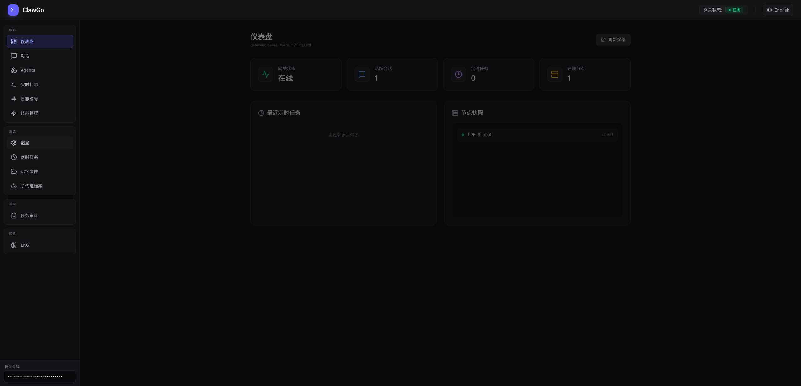
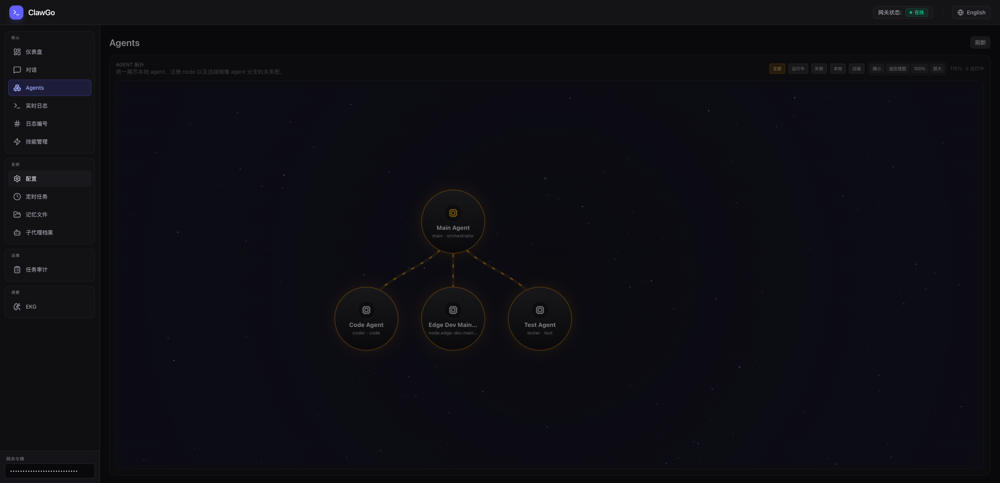
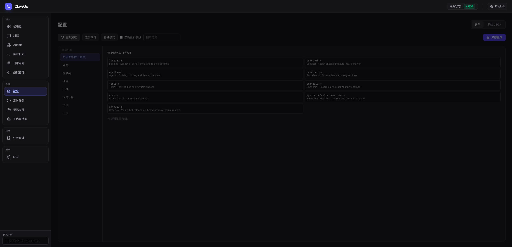

# ClawGo 🦞

**面向生产的 Go 原生 Agent Runtime。**

ClawGo 不是“又一个聊天壳子”，而是一套可长期运行、可观测、可恢复、可编排的 Agent 运行时。

- 👀 **可观测**：Agent 拓扑、内部流、任务审计、EKG 一体化可见
- 🔁 **可恢复**：运行态落盘，重启后任务可恢复，watchdog 按进展续时
- 🧩 **可编排**：`main agent -> subagent -> main`，支持本地与远端 node 分支
- ⚙️ **可工程化**：`config.json`、`AGENT.md`、热更新、WebUI、声明式 registry

[English](./README_EN.md)

## 为什么是 ClawGo

大多数 Agent 项目停留在：

- 一个聊天界面
- 一组工具调用
- 一段 prompt

ClawGo 更关注真正的运行时能力：

- `main agent` 负责入口、路由、派发、汇总
- `subagent` 负责编码、测试、产品、文档等具体执行
- `node branch` 把远端节点挂成受控 agent 分支
- `runtime store` 持久化 run、event、thread、message、memory

一句话：

> **ClawGo = Agent Runtime，而不只是 Agent Chat。**

## 核心亮点 ✨

### 1. 多 Agent 拓扑可视化

- 统一展示 `main / subagents / remote branches`
- 内部流与用户主对话分离
- 子 agent 协作过程可观测，但不污染用户通道

### 2. 任务可恢复，不是一挂全没

- `subagent_runs.jsonl`
- `subagent_events.jsonl`
- `threads.jsonl`
- `agent_messages.jsonl`
- 重启后可恢复运行中的任务

### 3. watchdog 按进展续时

- 系统超时统一走全局 watchdog
- 还在推进的任务不会因为固定墙钟超时被直接杀掉
- 无进展时才超时，行为更接近真实工程执行

### 4. 配置工程化，而不是 prompt 堆砌

- `config.json` 管理 agent registry
- `system_prompt_file -> AGENT.md`
- WebUI 可编辑、热更新、查看运行态

### 5. 适合真正长期运行

- 本地优先
- Go 原生 runtime
- 多通道接入
- Task Audit / Logs / Memory / Skills / Config / Agents 全链路闭环

## WebUI 亮点 🖥️

**Dashboard**



**Agents 拓扑**



**Config 工作台**



## 快速开始 🚀

### 1. 安装

```bash
curl -fsSL https://raw.githubusercontent.com/YspCoder/clawgo/main/install.sh | bash
```

### 2. 初始化

```bash
clawgo onboard
```

### 3. 配置模型

```bash
clawgo provider
```

### 4. 启动

交互模式：

```bash
clawgo agent
clawgo agent -m "Hello"
```

网关模式：

```bash
clawgo gateway run
```

开发模式：

```bash
make dev
```

WebUI:

```text
http://<host>:<port>/webui?token=<gateway.token>
```

## 架构概览

默认协作模式：

```text
user -> main -> worker -> main -> user
```

当前系统包含四层：

1. `main agent`
   负责用户入口、路由、派发、汇总
2. `local subagents`
   在 `config.json -> agents.subagents` 中声明，使用独立 session 和 memory namespace
3. `node-backed branches`
   远端节点作为受控 agent 分支挂载到主拓扑
4. `runtime store`
   保存运行态、线程、消息、事件和审计数据

## 你能用它做什么

- 🤖 本地长期运行的个人 Agent
- 🧪 `pm -> coder -> tester` 这种多 Agent 协作链
- 🌐 本地主控 + 远端 node 分支的分布式执行
- 🔍 需要强观测、强审计、强恢复的 Agent 系统
- 🏭 想把 prompt、agent、工具权限、运行策略工程化管理的团队

## 配置结构

当前推荐结构：

```json
{
  "agents": {
    "defaults": {
      "context_compaction": {},
      "execution": {},
      "summary_policy": {}
    },
    "router": {
      "enabled": true,
      "main_agent_id": "main",
      "strategy": "rules_first",
      "policy": {
        "intent_max_input_chars": 1200,
        "max_rounds_without_user": 200
      },
      "rules": []
    },
    "communication": {},
    "subagents": {
      "main": {},
      "coder": {},
      "tester": {}
    }
  }
}
```

说明：

- `runtime_control` 已移除
- 当前使用：
  - `agents.defaults.execution`
  - `agents.defaults.summary_policy`
  - `agents.router.policy`
- 启用中的本地 subagent 必须配置 `system_prompt_file`
- 远端分支需要：
  - `transport: "node"`
  - `node_id`
  - `parent_agent_id`

完整示例见 [config.example.json](/Users/lpf/Desktop/project/clawgo/config.example.json)。

## Prompt 文件约定

推荐把 agent prompt 独立为文件：

- `agents/main/AGENT.md`
- `agents/coder/AGENT.md`
- `agents/tester/AGENT.md`

配置示例：

```json
{
  "system_prompt_file": "agents/coder/AGENT.md"
}
```

规则：

- 路径必须是 workspace 内相对路径
- 仓库不会内置这些示例文件
- 用户或 agent workflow 需要自行创建实际的 `AGENT.md`

## 记忆与运行态

ClawGo 不是所有 agent 共用一份上下文。

- `main`
  - 保存主记忆与协作摘要
- `subagent`
  - 使用独立 session key
  - 写入自己的 memory namespace
- `runtime store`
  - 持久化任务、事件、线程、消息

这带来三件事：

- 更好恢复
- 更好追踪
- 更清晰的执行边界

## 当前最适合的人群

- 想用 Go 做 Agent Runtime 的开发者
- 想要可视化多 Agent 拓扑和内部流的团队
- 不满足于“聊天 + prompt”，而想要真正运行时能力的用户

如果你想快速上手，先看 [config.example.json](/Users/lpf/Desktop/project/clawgo/config.example.json)，再跑一次 `make dev`。
